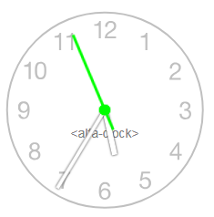

# alfa-clock

Polymer web component to display a clock.



## use example

```html
   <link rel="import" href="alfa-clock/alfa-clock.html">

    <style>
        alfa-clock {float: left;}
        alfa-clock.red{
            --seconds-color: red; 
            --ring-css: 6px solid red; 
            --hands-color: darkred; 
            --shadow-color: none; 
            --face-filter: invert(.5) sepia(5) saturate(25) hue-rotate(-45deg); 
        }
        alfa-clock.bigger{ --size: 400px; --brand-font: 2em Arial}
    </style>
    <alfa-clock></alfa-clock>
    <alfa-clock class="red" clock-brand="red clock"></alfa-clock>
    <alfa-clock class="bigger" clock-brand="bigger clock"></alfa-clock>

```

## CSS API


|variable|default|descr|
|---|---|---|
|--size:| 250px;|clock diameter|
|--seconds-color:| lime;|seconds hand color|
|--hands-color: |white;|other hands color|
|--shadow-color: |black;|other hands shadow|
|-ring-css:| 2px solid silver;|css for a ring around the clock face|
|--brand-font:| 1em Arial, Helvetica, sans-serif;| css font for a branding text on clock face|
|--brand-color: |grey; | NOTE: SVG filter will change this color |
|--face-filter: |none; | to color an SVG face|

## face-filter
The clock face is made with SVG image containing numbers for hours.  
To change the color of SVG, a CSS `filter` is applied.  
`--face-filter: invert(.5) sepia(5) saturate(25) hue-rotate(-45deg);`  
Try to manipulate `saturation` and `hue-rotate` to achieve desired color. It is hard, but blame the CSS committee.

Examples of colors:  
```css
--face-filter: invert(1); /* black */
--face-filter: invert(.5) sepia(1) saturate(5) hue-rotate(60deg);  /* green */
--face-filter: invert(.5) sepia(5) saturate(25) hue-rotate(-45deg); /* red */
```

